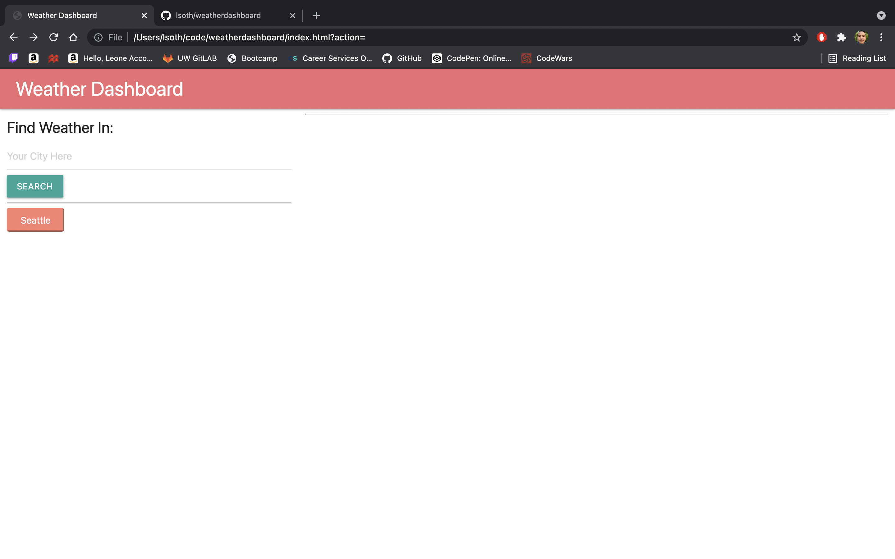
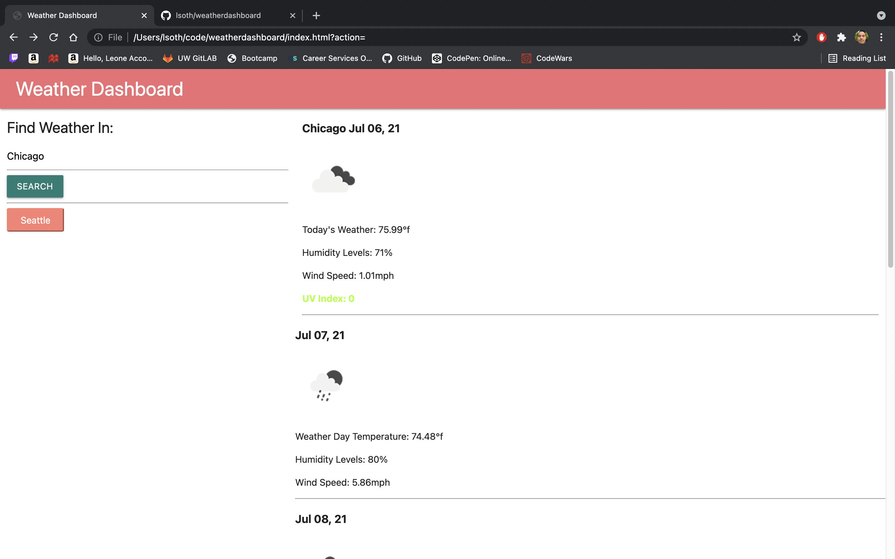

# weatherdashboard

## Description
For this project, the goal was to create a weather dashboard where someone can search any city, and find out the weather conditions
for the day, as well as the five day forcast. There are icons displaying how the weather is like and forcasted to be, further more
there is a UV index value that changes colors depending on the value of it! There is also a search history button, for previous searches.

## Installation

To open the project just visit this url: https://lsoth.github.io/weatherdashboard/

## Usage

Here are some examples of what the website looks like: 

## Credits

For this project I used class notes and materials as well as online resources like:

https://materializecss.com/

https://openweathermap.org/forecast5

https://momentjs.com/docs/

https://api.jquery.com/category/selectors/

## Licence
